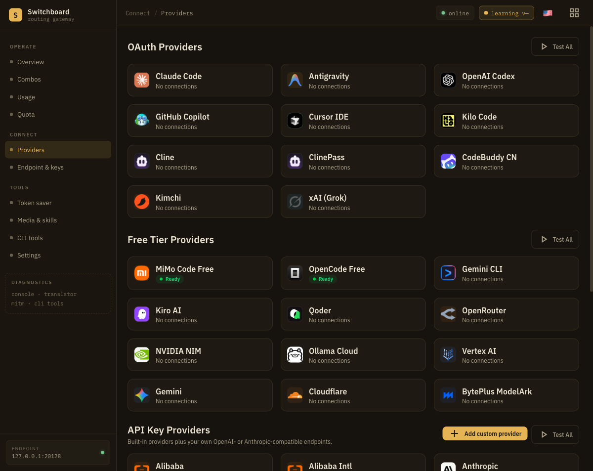
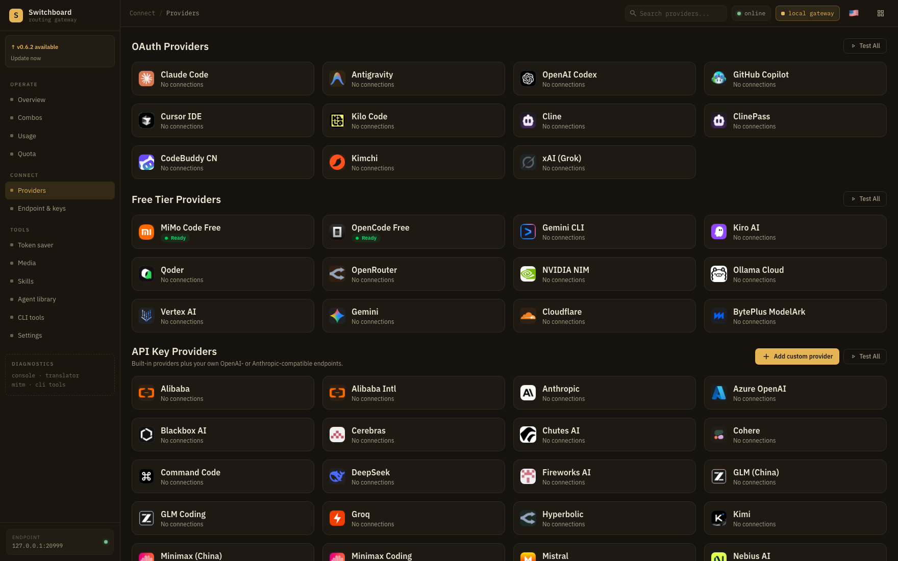

<p align="center">
  <h1 align="center">Switchboard</h1>
  <p align="center"><b>One local endpoint for every AI model you use.</b></p>
</p>

<p align="center">
  Point Claude Code, Cursor, Codex, Cline — or any OpenAI-compatible client — at Switchboard.<br/>
  It routes across your accounts and combos. <b>Auto</b> picks the right model and improves over time.
</p>

<p align="center">
  <a href="https://github.com/Vijay-Duke/switchboard-router/releases/latest"></a>
  
  
</p>

<p align="center">
  
</p>

---

## Install

Copy and run ([Node.js 18+](https://nodejs.org/) required):

```bash
curl -fsSL https://raw.githubusercontent.com/Vijay-Duke/switchboard-router/master/install.sh | bash
```

Then start it:

```bash
switchboard
```

| | |
|:--|:--|
| **Dashboard** | http://localhost:20128/dashboard |
| **API** | http://localhost:20128/v1 |

<details>
<summary>Other install options</summary>

**npm (once published):**
```bash
npm i -g switchboard-router && switchboard
```

**Direct package (no script):**
```bash
npm i -g https://github.com/Vijay-Duke/switchboard-router/releases/latest/download/switchboard-router.tgz && switchboard
```

**Docker:**
```bash
docker run -d --name switchboard -p 127.0.0.1:20128:20128 \
  -v "$HOME/.switchboard:/app/data" -e DATA_DIR=/app/data \
  -e SWITCHBOARD_LOCAL_PEERS=172.30.0.1 \
  ghcr.io/vijay-duke/switchboard-router:latest
```

> The dashboard only answers *local* callers, and a Docker bridge peer is not
> loopback. `SWITCHBOARD_LOCAL_PEERS` trusts the bridge range; the loopback-only
> publish keeps that trust off your LAN. Keep the two together — see [DOCKER.md](DOCKER.md).

> Package name is **`switchboard-router`**. The bare npm name `switchboard` is a different project.

</details>

---

## Connect a client

1. Open the [dashboard](http://localhost:20128/dashboard) and add a provider (OAuth or API key).
2. Copy the base URL and API key from **Endpoint & keys**.
3. Point your tool at Switchboard — or use **CLI tools** in the dashboard to configure Claude Code, Cursor, Codex, and others automatically.

```bash
export OPENAI_BASE_URL="http://127.0.0.1:20128/v1"
export OPENAI_API_KEY="sk-…"   # from the dashboard
```

---

## Features

| | |
|:--|:--|
| **One gateway** | OpenAI-compatible `/v1` for agents and SDKs |
| **Many providers** | Claude, Codex, Cursor, Gemini, free tiers, API keys |
| **Combos** | Fallback · round-robin · fusion · **Auto** |
| **Learning** | Auto improves which model wins per task type |
| **Local-first** | Your machine only — data in `~/.switchboard` |

<p align="center">
  
</p>

---

## Docs

[User guide](https://vijay-duke.github.io/switchboard-router/) · [Releases](https://github.com/Vijay-Duke/switchboard-router/releases)

---

## License

[MIT](cli/LICENSE)
