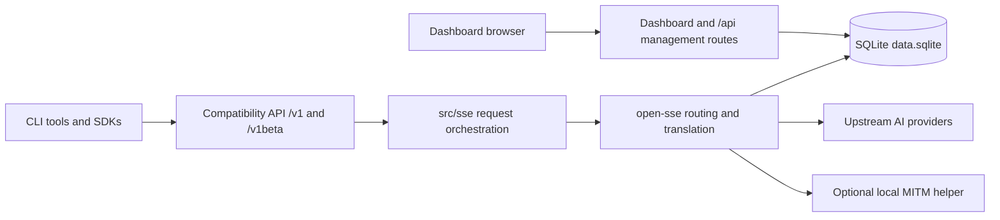
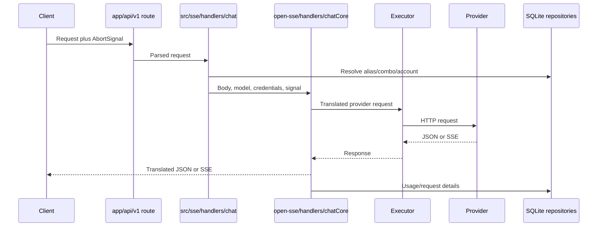

# Switchboard architecture

_Last verified: 2026-07-11_

Switchboard is a local Next.js dashboard and an OpenAI-compatible routing
gateway. One process owns the management API, compatibility endpoints,
translation, provider execution, and SQLite persistence. The default security
boundary is the local machine: the server binds to `127.0.0.1`, the dashboard
has no login, and non-loopback API traffic requires an active Switchboard API
key unless an operator explicitly disables that requirement.

## System boundary



External provider services and third-party CLI binaries are outside the
repository. Cloud sync and remote-hosting flows have been removed; the retained
cloud URL fields are compatibility data only.

## Request lifecycle

The primary chat path is:

1. `src/app/api/v1/*` accepts the client protocol and forwards the request to
   `src/sse/handlers/chat.js`.
2. The app-side handler resolves aliases, combos, provider connections, account
   priority, and API-key policy.
3. `open-sse/handlers/chatCore.js` detects the source protocol, translates the
   request, dispatches a provider executor, refreshes credentials when eligible,
   and translates the response back to the client protocol.
4. Streaming responses remain cancellation-aware. A client disconnect aborts
   upstream work; retry and fallback paths drain superseded response bodies.
5. Usage, request details, and Auto-routing outcomes are buffered and written to
   SQLite through repository interfaces.



## Routing layers

### Model and account fallback

`src/sse/handlers/chat.js` owns the application-level fallback loop. It selects
connections by provider and priority, rotates only for fallback-eligible
failures, and advances to the next combo member when the current provider is
exhausted. A malformed request or ordinary 404 does not rotate accounts.

### Auto routing

`open-sse/routing/handleAutoChat.js` owns policy and orchestration. Supporting
modules isolate prompt construction, response parsing, worker-response probing,
scoring, learning, and scheduling:

- `buildRouterPrompt.js` — request signals, health and learned routing context
- `parseRouterResponse.js` — constrained router-output parsing
- `autoResponse.js` — streaming/non-stream worker acceptance and protocol checks
- `scoring.js` — per-attempt outcome scoring
- `optimizer.js` — learned rules, bandit tables and replay evaluation
- `scheduler.js` — periodic learning runs

The router model is excluded from the worker pool. A single capable worker skips
the router, failed workers are not retried in the same chain, and every attempt
is attributed separately for learning.

## Provider and translation architecture

Provider definitions live under `open-sse/providers/registry/`. The generated
`registry/index.js` is checked by `scripts/generate-provider-registry.mjs` in CI.
Static catalogs are the reliable fallback; `open-sse/services/providerModels.js`
performs bounded, best-effort live discovery where a provider exposes a catalog.

Executors under `open-sse/executors/` absorb provider-specific URL, header,
retry, and transport behavior. Request and response translators register with
the leaf `open-sse/translator/registry.js`; `translator/index.js` is the public
orchestrator. Keeping registration below the orchestrator prevents the previous
translator import cycles.

## Persistence

All durable application state is stored in:

```text
${DATA_DIR}/db/data.sqlite
${DATA_DIR}/db/backups/      # five automatic backups
${DATA_DIR}/runtime/         # owned-process metadata and native runtime assets
```

If `DATA_DIR` is unset, the default is `~/.switchboard` on Unix-like systems and
`%APPDATA%/switchboard` on Windows.

The driver chain is runtime-specific:

- Bun: `bun:sqlite`, then `sql.js`
- Node: `better-sqlite3`, then built-in `node:sqlite` on Node 22.5+, then `sql.js`

`sql.js` is a last-resort fallback. It persists with write-to-temporary-file,
file sync, atomic rename, and directory sync. On startup, legacy JSON files are
migrated once. The deleted `src/lib/localDb.js` compatibility shim must not be
reintroduced; callers import `@/lib/db/index.js` or a focused repository.

Repositories cover settings, connections, nodes, keys, aliases, combos,
pricing, disabled models, probes, usage, request details, and routing events.
Provider credentials and nested provider-specific secrets are encrypted before
SQLite persistence.

## Startup and shutdown

`src/shared/services/initializeApp.js` performs process initialization once,
including DB cleanup, MITM state restoration, quota polling, routing retention,
and the Auto-learning scheduler.

Shutdown is ordered:

1. stop accepting work;
2. flush pending request details;
3. close the active SQLite adapter;
4. restore/remove managed DNS state;
5. exit, with a short forced-exit safety timer.

CLI and updater process control uses `${DATA_DIR}/runtime/owned-processes.json`.
Only owned PIDs are signalled: `SIGTERM`, an approximately two-second wait, then
`SIGKILL` if necessary. Process-name substring matching is intentionally banned.

## Security boundaries

- Dashboard: no cookie or password authentication. Keep it on loopback or put a
  trusted authenticated reverse proxy in front of it.
- Compatibility API: non-loopback requests require a Switchboard API key by
  default. `REQUIRE_API_KEY=false` is an explicit opt-out.
- Browser embedding: denied with `X-Frame-Options: DENY` and CSP
  `frame-ancestors 'none'`.
- CORS: no wildcard origin is emitted by `/v1`, `/v1beta`, health, or tag routes.
- Outbound URLs: user-configurable validation and embedding endpoints resolve
  DNS and reject private/cloud-metadata destinations. Redirects are rejected on
  model-catalog discovery.
- Secrets: API-key comparisons use fixed-width timing-safe digests; provider
  credentials are encrypted at rest; secret inputs are not browser-autofilled.
- Logging: detailed request logging is opt-in and its files must be treated as
  sensitive.

Wildcard binding requires `npm run start:standalone`. The custom server derives
the peer address from the TCP socket; forwarded headers are not trusted by the
ordinary Next.js server.

## Deployment topology

The CLI package contains the Next.js standalone output, the local launcher,
MITM assets, updater, and `sql.js`. Docker uses the same standalone server,
publishes port 20128, includes a health check, and uses a fixed Compose subnet so
`SWITCHBOARD_LOCAL_PEERS` can name only the Compose gateway rather than a broad
private network.

Release and documentation delivery are separate:

- `.github/workflows/release.yml` publishes only from an immutable `v*` tag
  whose version matches every package manifest and lockfile.
- `.github/workflows/docs.yml` deploys documentation changes and does not create
  a product release.
- A correction to a published release receives a new patch version and tag.

## Configuration precedence

The complete environment contract is documented in
[`ENVIRONMENT.md`](./ENVIRONMENT.md). In general:

1. an explicit environment override wins when a module documents one;
2. otherwise persisted SQLite settings win;
3. otherwise the code default applies.

Not every environment variable overrides a database setting. For example,
`REQUIRE_API_KEY` is a deliberate operator override, while proxy settings are
normally managed in SQLite and mirrored into process environment variables at
runtime.

## Operational verification

```bash
npm run lint
npm run check:i18n
npm run check:providers
npm run check:versions
cd tests && npx vitest run
cd .. && npm run build
npm run cli:pack
npm --prefix gitbook run build
```

For Docker-capable hosts, additionally build the image, start Compose, check
`/api/health`, list `/v1/models`, and send one authenticated chat request.
